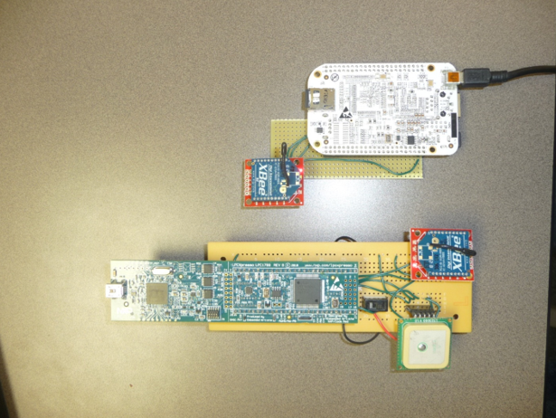
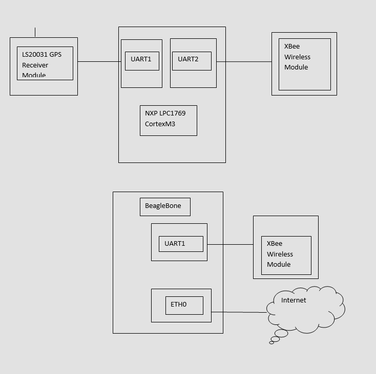
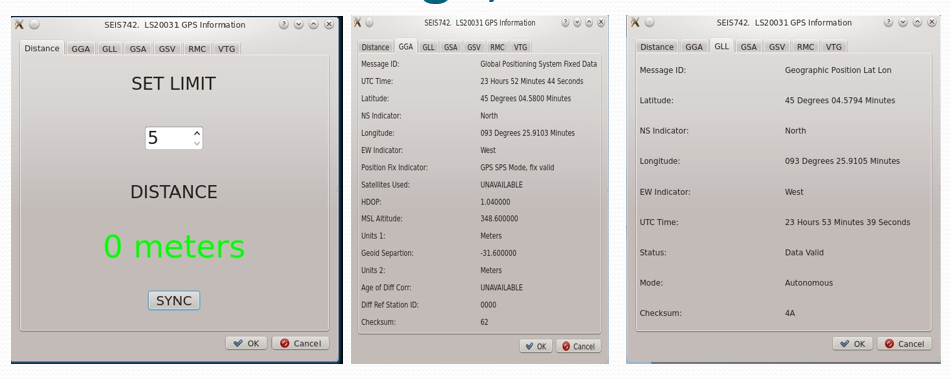

# WirelessGPS

Capturing GPS signal with LS20031 controlled by NXP LCP1769 CortexM3, sending to PC using Xbee modules and BeagleBone, and disiplaying results in QT application.  
  
Hardware:    
 

Block diagram:  
  

Tabs application screenshot:  
  

